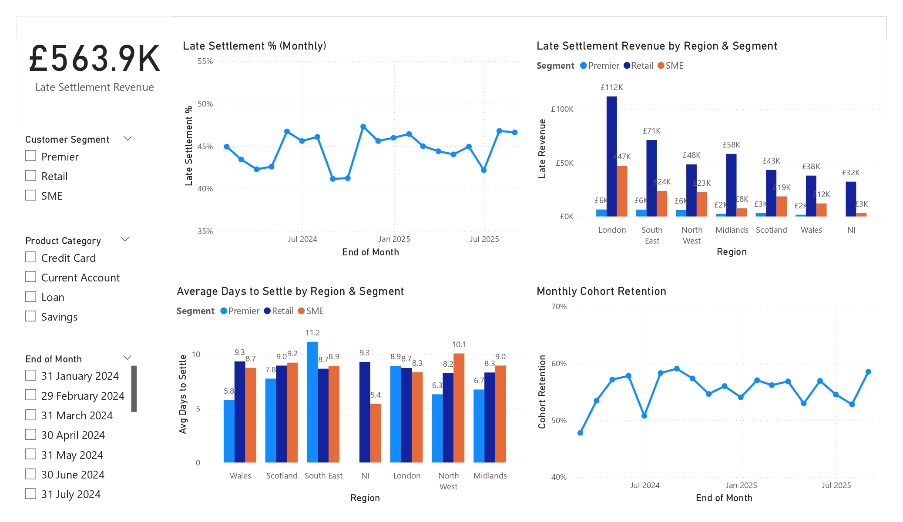

# FS-Analytics-Dashboard

## Problem
Leaders need a fast read on revenue health, customer activity, and cash risk (late settlements), with enough detail to act by region/segment/product.

## Approach
- Two-page Power BI report over transactions + customers
- Star schema: `Transactions` fact with `Date`/`Customers` dimensions
- Time intelligence via dedicated `Date` table (marked as Date)
- KPIs: Total Revenue, Active Customers (30D), AOV, Late Settlement %, Avg Days to Settle, Cohort Retention (30D)

## Metrics (as of latest refresh)
- **Total Revenue:** £1.3M
- **Active Customers (30D):** 271
- **AOV:** £158
- **Late Settlement %:** 44.7%
- **Average Days to Settle:** 8.72
- **Cohort Retention (30D):** 58.5%
- **Late Settlement Revenue:** £563.9K

## Decisions enabled
- Prioritise collections where late-settlement revenue is highest (by region/segment/product).
- Focus on channels/products driving late settlements to reduce days-to-settle.
- Track returning-customer momentum to forecast demand and guide lifecycle messaging.

## How to run
1. Open `/powerbi/dashboard.pbix` in Power BI Desktop.
2. Point to `/data/customers.csv`, `/data/products.csv` and `/data/transactions.csv` (or your source tables).
3. Refresh; export two screenshots to `/images/`:
   - `kpi.jpg` (KPI page)
   - `risk&retention.jpg` (Risk & Retention page)
4. Open `.csv`, `.jpg`, `.pdf`, and `.md` files using compatible applications.

## Screenshots

## Data
Synthetic sample data can be used to demo structure; replace with your live source as needed.

---

**Credits:** Built with Power BI + DAX.
